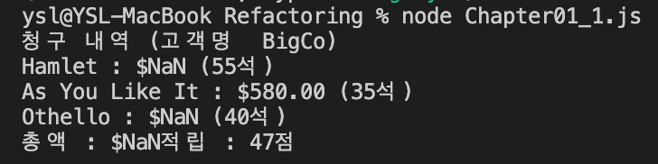

# Copy of Refactoring

# 1.1 리팩터링 맛보기 예시

```jsx
function statement(invoice, pays){
    let totalAmount = 0;
    let volumeCredits = 0;
    let result = `청구 내역 (고객명  ${invoice.customer})\n`

    // Intl : https://developer.mozilla.org/ko/docs/Web/JavaScript/Reference/Global_Objects/Intl 각 언어에 맞게 비교 기능.
    const format = new Intl.NumberFormat("en-US", {
        style : "currency", currency: "USD", minimumFractionDigits: 2
    }).format;
    
    for(let perf of invoice.performances){
        const play = plays[perf.playID];
        let thisAmount = 0;

        switch (play.type){
            case "tragedy":
                thisAmount = 40000;
                if(perf.audience > 30){
                    thisAmount += 1000 * (perf.audienc -30);
                }
                break;
            case "comedy":
                thisAmount = 30000;
                if(perf.audience > 20){
                    thisAmount += 10000 + 500 * (perf.audience - 20);
                }
                thisAmount += 300* perf.audience;
                break;
            default:
                throw new Error('알 수 없는 장르 : ${play.type}');
        }

        // 포인트 적립 및 추가 포인트 적립.
        volumeCredits += Math.max(perf.audience - 30, 0);
        if("comedy" === play.type) volumeCredits += Math.floor(perf.audience / 5);

        result += `${play.name} : ${format(thisAmount/100)} (${perf.audience}석)\n`;
        totalAmount += thisAmount;
    }

    result += `총액 : ${format(totalAmount/100)}`;
    result += `적립 : ${volumeCredits}점\n`;

    return result;
}
```



해당 예시 코드를 보면서 리팩터링 해야할 부분이 뭐가 있을까? 생각 해보았을 때 바로 든 생각 : 
switch문에서 문자열 2가지 (tragedy, comedy)만 처리 하고 있으니까, 장르가 늘어난다면 수동적인 추가를 해주어야 할 것이다.

## 프로그램이 새로운 기능을 추가하기에 편한 구조가 아니라면, 먼저 기능을 추가하기 쉬운 형태로 리팩터링하고 나서 원하는 기능을 추가한다.

저자가 말하는 리팩터링 해야할 부분 : 

1. 청구 내역을 HTML로 출력하는 기능이 필요.
2. **더 많은 장르의 연극을 원할 때 공연료, 포인트에 영향을 미칠 것.**

### statement() 함수 쪼개기.

가장 눈에 띄눈 문제 : switch()
이 부분을 쪼갠다. statement() 안에 있었지만, '함수 추출하기'를 통해 amountFor() 함수로 분리한다.

즉, amountFor() 함수는 statement() 안에 있고, perf, play변수를 매개변수로 사용하는 중첩 함수로 사용된다.

```jsx
function amountFor(perf, play){
    switch (play.type){
        case "tragedy":
            thisAmount = 40000;
            if(perf.audience > 30){
                thisAmount += 1000 * (perf.audienc -30);
            }
            break;
        case "comedy":
            thisAmount = 30000;
            if(perf.audience > 20){
                thisAmount += 10000 + 500 * (perf.audience - 20);
            }
            thisAmount += 300* perf.audience;
            break;
        default:
            throw new Error('알 수 없는 장르 : ${play.type}');
    }
    return thisAmount;
}
function statement(invoice, plays){
    let totalAmount = 0;
    let volumeCredits = 0;
    let result = `청구 내역 (고객명  ${invoice.customer})\n`

    // Intl : https://developer.mozilla.org/ko/docs/Web/JavaScript/Reference/Global_Objects/Intl 각 언어에 맞게 비교 기능.
    const format = new Intl.NumberFormat("en-US", {
        style : "currency", currency: "USD", minimumFractionDigits: 2
    }).format;
    
    for(let perf of invoice.performances){
        const play = plays[perf.playID];
        
        // let thisAmount = 0;   --> 함수 호출로 변경.
        let thisAmount = amountFor(perf, play);
        // switch 문이 있던 자리.

        // 포인트 적립 및 추가 포인트 적립.
        volumeCredits += Math.max(perf.audience - 30, 0);
        if("comedy" === play.type) volumeCredits += Math.floor(perf.audience / 5);

        result += `${play.name} : ${format(thisAmount/100)} (${perf.audience}석)\n`;
        totalAmount += thisAmount;
    }

    result += `총액 : ${format(totalAmount/100)}`;
    result += `적립 : ${volumeCredits}점\n`;

    return result;
}

const invoices = require('./invoices.json'); 
const plays = require('./plays.json');

console.log(statement(invoices[0], plays));
```

